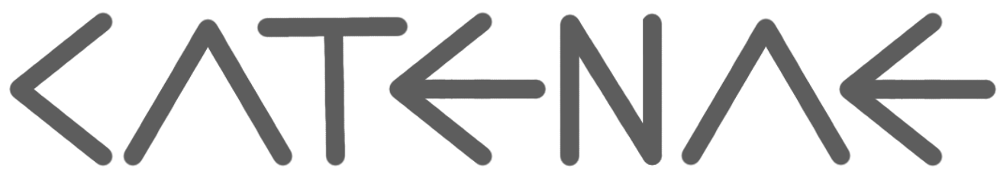

Catenae is a Python library for **building distributed Stream Processing applications in minutes**. An application is usually composed of multiple micromodules (Python scripts) that can be interconnected through named streams. Catenae-based systems can scale up horizontally by increasing the number of instances of any micromodule without further configuration. The communication between micromodules is managed by Apache Kafka.

Every module can consume and/or produce messages on one or multiple streams (Kafka topics). Catenae is a Python client library for Kafka that facilitates common tasks and whose main goal is to make you forget about Kafka.

Despite it is focused on Python developments, a Catenae topology can interoperate with any Kafka producer or consumer. This can be trivially achieved when sending messages in string format on the external Kafka producers and analogously on external Kafka consumers.

Among Catenae's main functionalities are:
- RPC invocations among micromodules by instance or class
- Priority support for multiple input streams
- Sequential and synchronous modes for critical systems
- Custom wrappers for MongoDB and Aerospike clients
- Transparent serialization and deserialization for Python objects

# Requirements

**Development**
- Docker
- Docker Compose

**Production**
- Docker
- Kafka cluster
- Docker orchestrator

# Docs

> TO-DO...

We can think of every micromodule as a node of a graph where edges are defined with the streams with which they are connected. Well, each node of the graph is called link and can be created implementing the `Link` class.

Streams are composed of `Electron` instances which are containers mainly composed by a key and a value. However, strings can also be consumed and produced by the links of a Catenae topology.

## Synonyms
| Catenae  | Kafka | Graph | Other |
|----------|-------|-------|-------|
| stream, topic | topic | edge |  - |
| link, micromodule, module | - | node | microservice |
| electron | message | - | container |
| source link, generator | producer | root | - |
| middle link, transformer | consumer/producer | node | mapper |
| leaf link | consumer | leaf node | reducer |

## The `Link` class
In order to define a new micromodule, we have to create a new Python script with a class implementing the `Link` class.

```python
from catenae import Link, Electron


class FirstLink(Link):
    pass
```

The micromodule instance will start when executing its `start()` method. We can define the main behaviour as follows:
```python
from catenae import Link, Electron


class FirstLink(Link):
    pass
    

if __name__ == "__main__":
    FirstLink().start()
```

Usually, there will be micromodules in a topology that generate that. This modules read the data from databases or from APIs and input them into a topology's stream. We can get this behaviour by defining the `generator` method.

### Generators

For this example, we will use the ISS (Internation Space Station) API. The endpoint `http://api.open-notify.org/iss-now` gives as a JSON with the current location of the station.

The `setup()` works as a constructor and we can initialize there what we want to use across the micromodules' methods and invocations when receiving new data from a stream. We do not actually need it for this example but we will forcefully use it for storing the endpoint of the API.

```python
from catenae import Link, Electron


class FirstLink(Link):
    
    def setup(self):
        self.iss_endpoint = 'http://api.open-notify.org/iss-now'
    

if __name__ == "__main__":
    FirstLink().start()
```

We define now a method to consume the API.

```python
from catenae import Link, Electron
import json
import urllib.request


class FirstLink(Link):
    
    def setup(self):
        self.iss_endpoint = 'http://api.open-notify.org/iss-now'

    def get_current_iss_location(self):
        data = urllib.request.urlopen(self.iss_endpoint).read()
        location = json.loads(data)
        return location['iss_position']
    

if __name__ == "__main__":
    FirstLink().start()
```

We add the `generator()` method to stream the location of the ISS every second. For that we will use the `send()` method.


```python
from catenae import Link, Electron
import json
import urllib.request
import time


class FirstLink(Link):    
    
    def setup(self):
        self.iss_endpoint = 'http://api.open-notify.org/iss-now'

    def get_current_iss_location(self):
        data = urllib.request.urlopen(self.iss_endpoint).read()
        return json.loads(data)

    def generator(self):
        while True:
            iss_location_dict = self.get_current_iss_location()
            self.send(iss_location_dict, topic='iss_positions')
            time.sleep(1)
    

if __name__ == "__main__":
    FirstLink().start()
```

Note that we have defined the topic (stream) when invoking the `send()` method. We will see later that this is not actually needed if we define a default output stream.

And that's it. We have coded our first source micromodule.

Most of the links of a Catenae topology will not be generators but consumers and producers at the same time (middle links). We will now define a middle link that consumes the output stream of the previous one.

### Transformers

Instead of overriding the `generator()` method we will do it with the `transform()` one. The latter one will be invoked automatically every time an item is produced in any of the streams the module will be listening on. We will deepen in the `Electron` class later, so in the meanwhile just assume that is a container with a key and a value, where the content emitted by the first module will be in the `value` attribute.

The API response has the following JSON format, but it was already parsed to a Python `dict` in the first module, just before sending it.

```json
{  
   "message":"success",
   "timestamp":1559733853,
   "iss_position":{  
      "latitude":"3.9026",
      "longitude":"171.6748"
   }
}
```

Imagine we want to constantly calculate the displacement in terms of longitude. We will store the first received measure as an instance attribute. Then, for every received measure we will print the difference.

```python
from catenae import Link, Electron
import json
import urllib.request
import time


class SecondLink(Link):

    def setup(self):
        self.first_longitude = None
    
    def transform(self, electron):
        iss_location_dict = electron.value
        current_longitude = iss_location_dict['iss_position']['longitude']

        if self.first_longitude is None:
            self.first_longitude = current_longitude
            difference = 0
        else:
            difference = self.first_longitude - current_longitude

        print(f'Current longitude difference: {difference}')


if __name__ == "__main__":
    SecondLink().start()
```


## The `Electron` class
Electrons are containers with which are used to send data to other micromodules. We can define a **key** and a **value** but also the target stream if we do not want to use the default one.

`Electron` instances are created automatically when sending content to a stream. The actually sent data is stored in the `value` attribute of the `Electron` instance that will be accessible in the target modules. In fact, this is the most convenient way.

In a link with a `generator()` method the only way to send data through a given stream is using the `send()` method. 

```python
from catenae import Link, Electron


class SourceLink(Link):
    
    def generator(self):
        data = {'key1': 'value1'}
        self.send(data)


if __name__ == "__main__":
    SourceLink().start()
```

In a link with a `transform()` method data can also be returned. For instance, in the following example, the received data is reemitted. 

```python
from catenae import Link, Electron


class MiddleLink(Link):
    
    def transform(self, electron):
        return electron.value


if __name__ == "__main__":
    MiddleLink().start()
```

The previous snippet is equivalent to the shown below:

```python
from catenae import Link, Electron


class MiddleLink(Link):
    
    def transform(self, electron):
        self.send(electron.value)


if __name__ == "__main__":
    MiddleLink().start()
```

## Python execution
Direct Python executions are not recommended since Catenae is focused on Docker-based deployments. This serves as an example for launching micromodules within Docker images based on the provided `catenae/link` base image. In order to execute the following lines directly outside a Catenae-provided container, Python 3.6+ and the libraries listed in `requirements.txt` are required.

Suppose we have our micromodule stored in the file `middle_link.py`. In order to launch an instance of it, we have to provide, at least, a Kafka endpoint.

```bash
python middle_link.py -k kafkahost:9092
```

There are connectors for MongoDB and Aerospike which will be detailed later, but it worth it to advance that if we indicate their endpoints, clients will be instantiated automatically under `self.aerospike` and `self.mongodb` respectively.

```bash
python middle_link.py -k kafkahost:9092 -m mongohost:27017
```

```bash
python middle_link.py -k kafkahost:9092 -a aerospikehost:3000
```

In order to define the default input streams and output stream we can proceed as below:

**Source link**
```bash
python middle_link.py -k kafkahost:9092 -o stream1
```

**Middle link**
```bash
python middle_link.py -k kafkahost:9092 -i stream1 -o stream2
```

**Leaf link**
```bash
python middle_link.py -k kafkahost:9092 -i stream2
```

## Scaling up a micromodule
Catenae streams are Kafka topics, which are divided into partitions. If we want to divide a stream among multiple micromodules, they must indicate its belonging to the same Kafka consumer group. A custom Kafka consumer group can be set as shown below with the `consumer_group` argument of the `Link` constructor.

```python
from catenae import Link, Electron


class MiddleLink(Link):
    
    def transform(self, electron):
        return electron.value


if __name__ == "__main__":
    MiddleLink(consumer_group='CustomConsumerGroup').start()
```

However, **this is done automatically** by Catenae **when launching multiple instances of the same module**.

If we want the opposite behaviour, force multiple instances of the same module to consume the full stream, we can set the `uid_consumer_group` flag also in the `Link` constructor. This sets the Kafka consumer group to the unique identifier of the instance of the module to be launched.

```python
from catenae import Link, Electron


class MiddleLink(Link):
    
    def transform(self, electron):
        return electron.value


if __name__ == "__main__":
    MiddleLink(uid_consumer_group=True).start()
```

## Split streams by key 

If the key of an `Electron` instance is set, it will act as the Kafka partition key. Kafka consumers, and therefore Catenae micromodules, are not guaranteed to receive the items in order if they belong to different partitions.

When the stream is divided across multiple instantiated micromodules, using a key will ensure that those electrons sharing that key will arrive in order and to a single instance.

Imagine that we are streaming logs of the interaction of the users of some Web platform. We want to process that data in parallel by launching multiple instances of a micromodule. The operation that we need to perform must act over all the available user logs of the last hour. The ideal scenario would be to distribute users instead of individual logs so each instance will receive logs that match any of their randomly assigned keys.

```python
from catenae import Link, Electron


class LogDistributor(Link):
    
    def transform(self, electron):
        # 2019/02/11 00:34:32 [ERROR] @brunneis /files/search?q=pdf
        username = electron.value.split()[3]
        return Electron(key=username, value=electron.value)


if __name__ == "__main__":
    LogDistributor().start()
```

```python
from catenae import Link, Electron


class LogAnalyzer(Link):
    
    def transform(self, electron):
        ...


if __name__ == "__main__":
    LogAnalyzer().start()
```


## Connectors
There are two wrappers included at the moment for communicating with MongoDB and Aerospike instances. The main idea behind these wrappers is to enable similar interactions with different stores.

### Put

```python
from catenae import Link, Electron


class MiddleLink(Link):

    def setup(self):
        self.mongodb.set_defaults('test_database', 'test_collection')
    
    def transform(self, electron):
        self.mongodb.put(electron.value)


if __name__ == "__main__":
    MiddleLink().start()
```

```python
from catenae import Link, Electron


class MiddleLink(Link):

    def setup(self):
        self.aerospike.set_defaults('test_namespace', 'test_set')
    
    def transform(self, electron):
        self.aerospike.put(electron.value)


if __name__ == "__main__":
    MiddleLink().start()
```

> TO-DO


## RPC
> TO-DO

## Execution modes
> TO-DO

## Launch micromodules with Docker
> TO-DO

## Deploy a topology with Docker Compose
> TO-DO

# Example 1: Filter
Try it at [`examples/filter`](https://github.com/catenae/catenae/tree/develop/examples/filter)

## Micromodules

### Streamer
This module streams a line of the defined text every two seconds.
```python
#!/usr/bin/env python
# -*- coding: utf-8 -*-

from catenae import Link, Electron
import time


class Streamer(Link):
    def setup(self):
        self.lines = ("A purely peer-to-peer version of electronic cash would allow online " \
                      "payments to be sent directly from one party to another without going " \
                      "through a financial institution. Digital signatures provide part of the " \
                      "solution, but the main benefits are lost if a trusted third party is still "\
                      "required to prevent double-spending. We propose a solution to the "\
                      "double-spending problem using a peer-to-peer network. The network "\
                      "timestamps transactions by hashing them into an ongoing chain of "\
                      "hash-based proof-of-work, forming a record that cannot be changed without "\
                      "redoing the proof-of-work. The longest chain not only serves as proof of "\
                      "the sequence of events witnessed, but proof that it came from the largest "\
                      "pool of CPU power. As long as a majority of CPU power is controlled by "\
                      "nodes that are not cooperating to attack the network, they'll generate the "\
                      "longest chain and outpace attackers. The network itself requires minimal "\
                      "structure. Messages are broadcast on a best effort basis, and nodes can "\
                      "leave and rejoin the network at will, accepting the longest proof-of-work "\
                      "chain as proof of what happened while they were gone.").split('.')

    def generator(self):
        for line in self.lines:
            self.send(line.strip())
        time.sleep(2)


if __name__ == "__main__":
    Streamer().start()
```

### Filter
```python
from catenae import Link, Electron


class Filter(Link):
    def setup(self):
        self.allowed_words = set(['CPU', 'proof-of-work', 'chain', 'nodes'])

    def transform(self, electron):
        line = electron.value
        words = line.split()
        if set(words).intersection(self.allowed_words):
            self.logger.log(line)


if __name__ == "__main__":
    Filter().start()
```

## Deployment
```yaml
version: '3.4'

x-logging: &default-logging
  options:
    max-size: '50m'
    max-file: '1'
  driver: json-file

services:

  kafka:
    image: catenae/kafka
    logging: *default-logging

  streamer:
    image: catenae/link:develop
    command: streamer.py -o filter_input -k kafka:9092
    working_dir: /opt/catenae/examples/filter
    restart: always
    depends_on:
      - kafka

  filter:
    image: catenae/link:develop
    command: filter.py -i filter_input -k kafka:9092
    working_dir: /opt/catenae/examples/filter
    restart: always
    depends_on:
      - kafka
```

```bash
docker-compose up -d
```

# Example 2: Word Count
Try it at [`examples/wordcount`](https://github.com/catenae/catenae/tree/develop/examples/wordcount)

## Micromodules

### Streamer
> The same script of Example 1 will be used.

### Mapper
This module can be launched multiple times. It returns a tuple for every received line with the number of occurrences of each word. The streamed lines will be distributed among the existing instances automatically.

```python
#!/usr/bin/env python
# -*- coding: utf-8 -*-

from catenae import Link, Electron


class Mapper(Link):
    def get_counts(self, line):
        counts = dict()
        for word in line.split():
            word_lower = word.lower()
            word_clean = word.replace(',', '')
            if not word_clean in counts:
                counts[word_clean] = 1
            else:
                counts[word_clean] += 1
        for kv in counts.items():
            yield kv

    def transform(self, electron):
        for kv in self.get_counts(electron.value):
            self.logger.log(f'Tuple {kv} sent')
            self.send(kv)


if __name__ == "__main__":
    Mapper().start()
```

### Reducer
The last module of this topology will be instantiated only once and it is in charge of aggregating the stream of local counts emitted from the Mapper instances in real time. For every received tuple it will show the updated result.
```python
#!/usr/bin/env python
# -*- coding: utf-8 -*-

from catenae import Link, Electron


class Reducer(Link):
    def setup(self):
        self.counts = dict()

    def print_result(self):
        self.logger.log('=== Updated result ===')
        for kv in self.counts.items():
            self.logger.log(kv)
        self.logger.log()

    def reduce(self, wordcount):
        word, count = wordcount
        if not word in self.counts:
            self.counts[word] = count
        else:
            self.counts[word] += count

    def transform(self, electron):
        self.reduce(electron.value)
        self.print_result()


if __name__ == "__main__":
    Reducer().start()
```

## Deployment
```yaml
version: '3.4'

x-logging: &default-logging
  options:
    max-size: '50m'
    max-file: '1'
  driver: json-file

services:

  kafka:
    image: catenae/kafka
    logging: *default-logging

  streamer:
    image: catenae/link:develop
    command: streamer.py -o mapper_input -k kafka:9092
    working_dir: /opt/catenae/examples/wordcount
    restart: always
    depends_on:
      - kafka

  mapper:
    image: catenae/link:develop
    command: mapper.py -i mapper_input -o reducer_input -k kafka:9092
    working_dir: /opt/catenae/examples/wordcount
    restart: always
    depends_on:
      - kafka

  reducer:
    image: catenae/link:develop
    command: reducer.py -i reducer_input -k kafka:9092
    working_dir: /opt/catenae/examples/wordcount
    restart: always
    depends_on:
      - kafka
```

```bash
docker-compose up -d --scale mapper=4
```

# Open Source software using Catenae

| Name | Link | Description |
|------|------|-------------|
| Reddit Crawler | [github.com/brunneis/reddit-crawler](https://github.com/brunneis/reddit-crawler) | Crawl every Reddit's post in real time |
| REDD | [github.com/redd-system](https://github.com/redd-system) | Detect early signs of depression on Reddit |


# References
> A Micromodule Approach for Building Real-Time Systems with Python-Based Models: Application to Early Risk Detection of Depression on Social Media — R Martínez-Castaño, JC Pichel, DE Losada, F Crestani — European Conference on Information Retrieval, 2018 — [PDF](https://dev.brunneis.com/documents/Papers/ECIR%202018/A%20Micromodule%20Approach%20for%20Building%20Real-Time%20Systems%20with%20Python-Based%20Models:%20Application%20to%20Early%20Risk%20Detection%20of%20Depression%20on%20Social%20Media.pdf)

> Building Python-Based Topologies for Massive Processing of Social Media Data in Real Time — R Martínez-Castaño, JC Pichel, DE Losada — Proceedings of the 5th Spanish Conference on Information Retrieval, 2018
